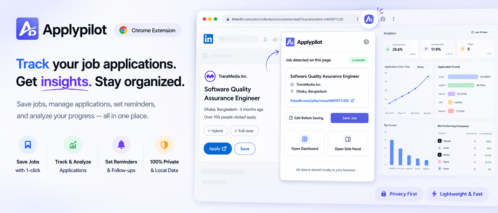

<!-- <p align="center">
  
</p> -->

<h1 align="center">Applypilot</h1>

<p align="center">
  A privacy-first browser extension for saving, organizing, and tracking job applications directly from job boards.
</p>

<p align="center">
  
</p>

<p align="center">
  <strong>Save jobs faster · Track applications · Set reminders · Analyze progress</strong>
</p>

<p align="center">
  <a href="https://apelmahmuddev.github.io/applypilot/">
    
  </a>
  <a href="https://github.com/apelmahmudDev/applypilot">
    
  </a>
</p>

---

## Overview

Applypilot helps job seekers manage their entire application journey without leaving the browser.

While viewing a supported job posting, Applypilot can detect the visible job information, let you review or edit the captured details, and save the job locally.

Saved applications can then be managed through the extension popup, side panel, or full dashboard.

## Key Features

- Detect job information from the current browser tab
- Review and edit detected details before saving
- Save jobs directly from supported job boards
- Track application status and progress
- View recently saved jobs
- Add follow-up, interview, and deadline reminders
- Manage applications from a browser side panel
- Explore analytics from a full dashboard
- Prevent duplicate entries using job URL, company, and title
- Store all application data locally in the browser
- Use minimal browser permissions

## Product Experience

### Extension Popup

The popup is designed for quick actions.

Use it to:

- detect the current job posting
- review the captured information
- edit job details before saving
- save a job with one click
- open the side panel
- open the full dashboard

### Side Panel

The side panel provides a larger workspace while you continue browsing.

Use it to:

- save and edit job postings
- view recently saved jobs
- update application statuses
- access job details
- review upcoming reminders
- manage applications without leaving the current tab

### Dashboard

The dashboard is the main workspace for managing larger amounts of application data.

It includes:

- complete application management
- searchable and structured job views
- application analytics
- status tracking
- source and company insights
- reminder management
- export-oriented workflows

## How It Works

1. Open a supported job posting.
2. Open the Applypilot popup or side panel.
3. Applypilot detects the visible job information.
4. Review the captured details.
5. Edit any incorrect or missing information.
6. Save the job to your local workspace.
7. Track the application later from the side panel or dashboard.

## Privacy

Applypilot follows a local-first approach.

Your saved jobs, application statuses, reminders, and other tracking data are stored locally using browser storage.

Applypilot does not require an account for its core functionality.

The extension is designed to request only the permissions needed for job detection, local storage, and the browser side panel.

## Duplicate Detection

Applypilot attempts to prevent duplicate job records using the following checks:

1. Exact job URL
2. Company name and job title

Each saved record also includes:

- `createdAt`
- `updatedAt`

## Tech Stack

- [WXT](https://wxt.dev/)
- React 19
- TypeScript
- Tailwind CSS 4
- shadcn/ui
- Radix UI primitives
- TanStack Form
- TanStack Table
- Zod
- Sonner
- pnpm

## Browser Permissions

Applypilot currently uses the following permissions:

```txt
activeTab
scripting
sidePanel
storage
```

Future job-board support should continue using the narrowest possible host permissions.

## Getting Started

### Prerequisites

Make sure the following tools are installed:

- Node.js
- pnpm

### Install Dependencies

```bash
pnpm install
```

## Development

### Chrome and Chromium Browsers

```bash
pnpm dev
```

### Firefox

```bash
pnpm dev:firefox
```

## Type Checking

```bash
pnpm compile
```

## Production Build

### Chrome and Chromium Browsers

```bash
pnpm build
```

### Firefox

```bash
pnpm build:firefox
```

## Create Distribution Packages

### Chrome and Chromium Browsers

```bash
pnpm zip
```

### Firefox

```bash
pnpm zip:firefox
```

## Load the Extension Locally

### Chrome and Chromium Browsers

1. Run the extension in development mode:

   ```bash
   pnpm dev
   ```

   Or create a production build:

   ```bash
   pnpm build
   ```

2. Open the Chrome extensions page:

   ```txt
   chrome://extensions
   ```

3. Enable **Developer mode**.

4. Click **Load unpacked**.

5. Select the generated WXT output directory.

### Firefox

1. Run the extension in development mode:

   ```bash
   pnpm dev:firefox
   ```

   Or create a production build:

   ```bash
   pnpm build:firefox
   ```

2. Open the Firefox debugging page:

   ```txt
   about:debugging
   ```

3. Select **This Firefox**.

4. Click **Load Temporary Add-on**.

5. Select the generated extension manifest from the build output.

## Project Status

Applypilot is currently under active development.

### Available Functionality

- Job detection
- Extension popup
- Browser side panel
- Local job storage
- Duplicate detection
- Application status tracking
- Reminder fields
- Dashboard foundation

### Planned Improvements

- Support for additional job boards
- Improved analytics
- Advanced search and filtering
- Richer reminder workflows
- Data import and export improvements
- Better job-description parsing

## Contributing

Contributions, suggestions, and bug reports are welcome.

Before submitting a pull request:

1. Create a new branch.
2. Make your changes.
3. Run the type checker.
4. Test the extension in a supported browser.
5. Submit a clear pull request describing your changes.

---

<p align="center">
  Your job search, organized with Applypilot.
</p>

<p align="center">
  <a href="https://apelmahmuddev.github.io/applypilot/"><strong>Installation Guide</strong></a>
  ·
  <a href="https://apelmahmuddev.github.io/applypilot/"><strong>View Demo</strong></a>
</p>
